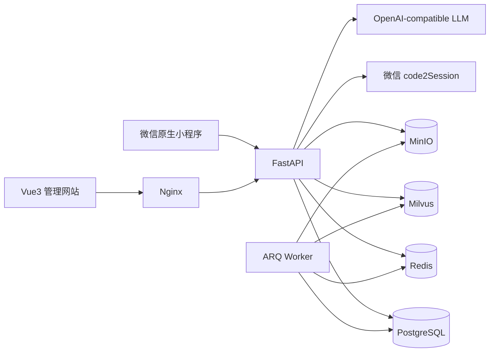
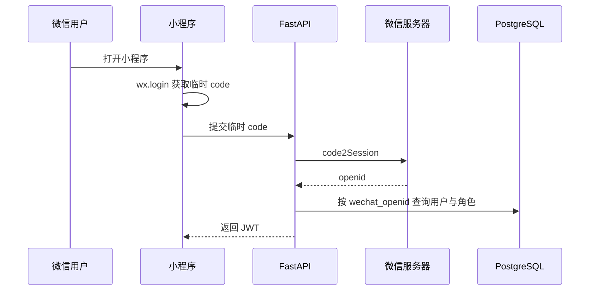

# 充电桩运维管理系统项目说明

> 文档版本：2026-09-29  
> 项目形态：Vue3 管理端 + 微信原生小程序 + FastAPI 统一后端  
> 数据存储：PostgreSQL + Milvus + Redis + MinIO

## 1. 项目概述

本项目面向充电站日常运维场景，建设一套覆盖“站点监控、工单处理、故障上报、知识检索、分析报告、权限管理和移动作业”的综合管理系统。

系统包含两个用户入口：

- **Vue3 后台管理网站**：面向平台管理员、管理人员和只读用户，负责全局管理、统计分析、人员权限、知识库与 AI 工作流。
- **微信小程序**：面向现场运维人员和管理员，负责移动接单、工单完成、故障上报、图片上传、消息查看及站点台账查询。

两个入口共用同一个 FastAPI 后端和同一套 PostgreSQL 业务数据库，确保小程序产生的工单和故障变化能够立即反映在管理网站中。

## 2. 项目需求

### 2.1 业务需求

传统充电站运维常见的问题包括：

- 工单分散在不同人员或沟通工具中，处理过程难以追踪。
- 现场故障缺少图片、站点和上报人等结构化信息。
- 管理人员无法快速了解全部站点的设备规模、健康度和风险。
- 运维知识分散在 PDF、Word、Excel 和图片中，查询效率较低。
- 报告依赖人工整理，指标口径和结论缺乏统一依据。
- Web 管理端适合集中管理，但不适合现场人员随时操作。

因此，系统需要形成以下业务闭环：

```text
发现任务或故障
      ↓
工单领取 / 故障上报
      ↓
现场处理与图片留痕
      ↓
完成工单 / 核查故障
      ↓
统计分析、报告生成与审计追踪
```

### 2.2 功能需求

系统主要需求包括：

1. 管理全部充电站、工单、故障和用户权限。
2. 支持工单创建、并发安全接单、处理和完成闭环。
3. 支持现场故障上报、图片上传及故障记录查询。
4. 支持微信官方授权登录，不在小程序保存用户名、密码或 AppSecret。
5. 根据用户角色展示不同的小程序功能和数据范围。
6. 支持知识文件解析、向量检索、基于证据的问答和报告生成。
7. 支持异步任务、消息提醒、失败重试、审计和健康检查。
8. 保证 Vue3 管理端与微信小程序共享业务数据，同时保持界面和交互相互独立。

### 2.3 非功能需求

- **安全性**：JWT、RBAC、密码哈希、服务端权限校验、敏感配置环境变量化。
- **一致性**：确定性业务规则由代码和数据库事务执行，不交给 LLM 判断。
- **并发安全**：工单接取使用条件更新，防止多人同时领取同一工单。
- **可追踪性**：关键操作写入审计日志，请求携带 Request ID。
- **可靠性**：健康检查、异步重试、死信任务和备份恢复机制。
- **可维护性**：Web、小程序和后端职责分离，接口和数据模型统一。

## 3. 用户角色与权限

系统使用 RBAC（Role-Based Access Control）管理权限。权限判断最终由 FastAPI 执行，前端隐藏按钮仅用于改善界面，不能代替服务端鉴权。

| 角色 | 主要使用入口 | 数据范围 | 典型功能 |
|---|---|---|---|
| 平台管理员 `admin` | Web、小程序 | 全部站点 | 全部工单、全部故障、站点台账、用户角色、审计与系统运维 |
| 运维人员 `operator` | Web、小程序 | 可接工单及本人数据 | 接单、完成本人工单、故障上报、现场图片、消息中心 |
| 只读用户 `viewer` | Web | 授权范围内的只读数据 | 总览、工单、故障、报告和知识检索 |

小程序中管理员和运维人员使用同一个登录入口，但登录后的工作台不同：

```text
管理员：      首页｜工单｜台账｜我的
普通运维人员：首页｜工单｜故障｜我的
```

## 4. 系统架构



### 4.1 统一后端设计

Vue3 管理端与微信小程序没有分别建设两套后端，而是共享：

- 同一个 FastAPI 应用；
- 同一个 PostgreSQL 数据库；
- 同一套 `User`、`Role`、`Station`、`WorkOrder`、`Fault` 和 `Message` 模型；
- 同一个 JWT 验证机制；
- 同一套确定性业务状态。

Web 管理端使用 `/api/v1/...` 管理接口，小程序使用 `/api/v1/mini/...` 移动端接口。两组接口面向不同交互场景，但读取和修改的是同一批业务实体。

### 4.2 技术栈

| 层次 | 技术 | 用途 |
|---|---|---|
| Web 前端 | Vue 3、TypeScript、Vite、Ant Design Vue | 后台管理网站 |
| 小程序 | WXML、WXSS、TypeScript、微信原生 API | 移动作业端 |
| API | FastAPI、Pydantic | REST API、参数验证和接口文档 |
| ORM | SQLAlchemy 2 | 领域模型与数据库访问 |
| 数据库 | PostgreSQL 16 | 用户、角色、站点、工单、故障和报告等业务数据 |
| 数据迁移 | Alembic | 数据库版本演进 |
| 缓存与队列 | Redis、ARQ | 登录限流、异步任务和定时任务 |
| 向量数据库 | Milvus | 知识文档向量检索 |
| 文件服务 | MinIO、本地上传目录 | 知识文件和现场图片 |
| AI 编排 | LangGraph | 多 Agent 工作流与人工确认 |
| 文档解析 | PyMuPDF、python-docx、openpyxl、RapidOCR | PDF、Word、Excel 和图片解析 |
| 部署 | Docker Compose、Nginx | 本地集成环境和反向代理 |

## 5. 核心实现

### 5.1 Web 账号登录与 RBAC

Web 用户使用用户名和密码登录：

1. FastAPI 查询用户并验证 PBKDF2 密码摘要。
2. 检查用户和角色是否启用。
3. 登录成功后签发 JWT。
4. 后续请求通过 `Authorization: Bearer <token>` 携带 JWT。
5. `require_permission()` 根据角色权限决定是否允许访问接口。

初始账号、新增账号或重置密码后的账号必须先修改初始密码，未修改前不能访问受保护的业务接口。

### 5.2 微信官方登录

小程序不提供用户名和密码输入框，而是使用微信官方 `wx.login`：



角色识别依赖以下映射：

```text
openid → users.wechat_openid → users.role_id → roles.code / permissions
```

首次出现的微信用户默认创建为普通运维人员，不能自动获得管理员权限。管理员身份必须由系统已有管理员显式分配。

`WECHAT_APP_ID` 和 `WECHAT_APP_SECRET` 只从后端 `.env` 读取。小程序代码、接口响应和应用日志均不应包含 AppSecret。

### 5.3 并发安全接单

接单不是先查询再更新，而是直接执行带状态条件的数据库更新：

```sql
UPDATE work_orders
SET status = 'in_progress', inspector_id = :user_id
WHERE id = :order_id
  AND status = 'pending_acceptance';
```

只有数据库返回更新行数为 `1` 时接单成功。如果两名运维人员同时操作，只有最先完成更新的用户成功，另一名用户收到 `409 Conflict`。

### 5.4 工单归属与完成规则

- 待接工单对运维人员可见。
- “我的工单”只查询 `inspector_id` 等于当前用户的记录。
- 普通运维人员只能查看待接工单或本人工单详情。
- 只有工单负责人本人可以完成处于 `in_progress` 状态的工单。
- 管理员可以查看全部工单，但移动端不会显示“我的工单”标签。

这些规则全部在 FastAPI 和 SQL 条件中执行，不能通过篡改小程序参数绕过。

### 5.5 故障上报和图片上传

运维人员选择站点后填写桩编号、故障等级和描述，并可以上传现场图片。

后端对图片执行以下检查：

- 仅允许 JPG、PNG 和 WebP；
- 拒绝空文件；
- 限制最大上传大小；
- 使用随机文件名，避免覆盖和路径注入；
- 故障记录写入当前登录用户的 `reporter_id`。

普通运维人员只能查询本人上报的故障，管理员可以查询全部故障。

### 5.6 管理员站点台账

当前小程序台账是**站点级设备汇总台账**，数据来自现有业务表，包括：

- 站点名称和地址；
- 充电桩数量；
- 站点健康度和运行状态；
- 累计工单数和活动工单数；
- 累计故障数和待核查故障数。

台账接口只允许管理员访问。普通运维人员即使手工请求接口也会收到 `403 Forbidden`。

### 5.7 知识库与 RAG

管理端可以建立多个知识库并上传 PDF、DOCX、XLSX、TXT、Markdown 和图片。后台 Worker 完成：

1. 文件流式保存与哈希计算；
2. 文档解析或 OCR；
3. 文本切片；
4. Embedding 生成；
5. 写入独立 Milvus Collection；
6. 保存来源文件、切片数量和任务状态。

问答采用“先检索、后生成”的流程。证据不足时系统明确拒答；LLM 不可用时返回检索原文或确定性模板，不影响核心业务。

### 5.8 确定性规则与多 Agent

系统把事实计算、风险等级和强制动作保留在确定性规则引擎中。LLM 主要负责解释、总结和建议，不能覆盖数据库事实或权威规则。

LangGraph 工作流包含数据分析、故障诊断、运维建议和主编排节点。高风险任务会进入人工确认状态，管理员可以批准、驳回或附加调整说明，操作全过程可审计。

## 6. 系统功能

### 6.1 Vue3 后台管理网站

| 模块 | 功能 |
|---|---|
| 运营总览 | 工单完成率、逾期率、待核查故障、危急故障和站点健康度 |
| 工单管理 | 创建、接单、完成、退回、取消和状态查询 |
| 故障中心 | 故障上报、等级管理、核查和处理记录 |
| AI 分析报告 | 即时、日报、周报、月报、报告对比和明细下钻 |
| 知识库 | 多知识库、文件上传、解析进度、重建、删除和检索问答 |
| Agent 工作流 | 创建分析任务、查看节点轨迹和人工确认 |
| 消息中心 | 紧急、逾期、退回和取消提醒，支持已读处理 |
| 角色与用户 | 用户、角色和权限配置，密码重置 |
| 系统运维 | 审计日志、健康状态、死信任务和失败重投 |

### 6.2 微信小程序——普通运维人员

- 冷启动自动执行微信授权登录；
- 登录失败弹出明确提示；
- 运维工作台和个人中心；
- 待接工单、我的工单和工单详情；
- 并发安全接单；
- 完成本人负责的工单；
- 故障上报和现场图片上传；
- 我的故障记录；
- 消息中心和已读处理；
- 固定底部工具栏。

### 6.3 微信小程序——管理员

- 管理员工作台和全站统计；
- 全部工单与待接工单；
- 全部故障记录；
- 站点设备汇总台账；
- 管理员角色信息和消息中心；
- 管理员专属底部工具栏。

## 7. 主要数据模型

| 模型 | 作用 | 关键字段 |
|---|---|---|
| `Role` | 角色与权限 | `code`、`permissions`、`enabled` |
| `User` | Web 与微信用户 | `username`、`role_id`、`wechat_openid`、`enabled` |
| `Station` | 充电站 | `name`、`location`、`pile_count`、`health_score`、`status` |
| `WorkOrder` | 运维工单 | `order_no`、`station_id`、`status`、`inspector_id`、`plan_date` |
| `Fault` | 故障记录 | `fault_no`、`station_id`、`reporter_id`、`level`、`image_urls` |
| `Message` | 站内消息 | `recipient_id`、`message_type`、`is_read` |
| `KnowledgeBase` | 知识库 | `name`、`collection_name`、`enabled` |
| `KnowledgeSource` | 知识来源文件 | `file_hash`、`parsed_text`、`chunk_count` |
| `Report` | 分析报告 | `report_type`、`station_id`、`period_start`、`content` |
| `AgentTask` | 多 Agent 任务 | `requested_by_id`、`status`、`current_node`、`result` |
| `AuditLog` | 关键操作审计 | `actor_id`、`action`、`resource_type`、`result` |

## 8. 主要接口

### 8.1 Web 管理端接口

| 方法 | 路径 | 说明 |
|---|---|---|
| `POST` | `/api/v1/auth/login` | Web 账号登录 |
| `GET` | `/api/v1/auth/me` | 当前用户与权限 |
| `GET/POST` | `/api/v1/work-orders` | 工单查询和创建 |
| `POST` | `/api/v1/work-orders/{id}/{action}` | 工单状态操作 |
| `GET/POST` | `/api/v1/faults`、`/api/v1/faults/report` | 故障查询与上报 |
| `POST` | `/api/v1/faults/{id}/verify` | 故障核查 |
| `GET/POST` | `/api/v1/reports`、`/api/v1/reports/generate` | 报告查询与生成 |
| `POST` | `/api/v1/knowledge/search` | 知识检索 |
| `POST` | `/api/v1/ai/agent/tasks` | 创建多 Agent 任务 |
| `GET` | `/api/v1/admin/audit-logs` | 查看审计日志 |

### 8.2 微信小程序接口

| 方法 | 路径 | 说明 |
|---|---|---|
| `POST` | `/api/v1/mini/auth/wechat-login` | 微信 code 登录 |
| `GET` | `/api/v1/mini/profile` | 用户、角色和权限信息 |
| `GET` | `/api/v1/mini/dashboard` | 角色化工作台数据 |
| `GET` | `/api/v1/mini/work-orders` | 可接、本人与全部工单查询 |
| `POST` | `/api/v1/mini/work-orders/{id}/accept` | 并发安全接单 |
| `POST` | `/api/v1/mini/work-orders/{id}/complete` | 完成本人工单 |
| `POST` | `/api/v1/mini/faults` | 上报故障 |
| `POST` | `/api/v1/mini/uploads` | 上传现场图片 |
| `GET` | `/api/v1/mini/faults` | 本人或全部故障查询 |
| `GET` | `/api/v1/mini/ledger` | 管理员站点台账 |
| `GET/POST` | `/api/v1/mini/messages/...` | 消息查询与已读处理 |

## 9. 项目目录

```text
Charging station/
├─ backend/
│  ├─ app/
│  │  ├─ main.py                 # FastAPI 应用与 Web 管理接口
│  │  ├─ mini_api.py             # 微信小程序接口
│  │  ├─ wechat_service.py       # code2Session 服务
│  │  ├─ auth.py                 # JWT、密码和 RBAC
│  │  ├─ models.py               # SQLAlchemy 领域模型
│  │  ├─ schemas.py              # Pydantic 请求与响应模型
│  │  ├─ deterministic_engine.py # 确定性规则引擎
│  │  ├─ agent_workflow.py       # LangGraph 多 Agent 编排
│  │  └─ knowledge_jobs.py       # ARQ 异步任务
│  ├─ alembic/                   # 数据库迁移
│  └─ tests/                     # 后端自动化测试
├─ frontend/
│  └─ src/                       # Vue3 管理端
├─ weixin/
│  └─ miniprogram/
│     ├─ pages/                  # 小程序页面
│     ├─ components/             # 导航栏与底部工具栏
│     └─ utils/api.ts            # 登录、请求和身份缓存
├─ knowledge_seed/               # 示例知识资料和导入脚本
├─ scripts/                      # 备份、恢复和评测脚本
├─ docs/                         # 运维与恢复文档
└─ docker-compose.yml            # 集成环境编排
```

## 10. 运行与配置

### 10.1 Docker Compose

本地集成环境包含以下服务：

```text
frontend、backend、worker、postgres、redis、milvus、minio、etcd
```

启动命令：

```bash
docker compose up --build
```

默认访问地址：

- 管理网站：<http://localhost:8080>
- FastAPI 文档：<http://localhost:8000/docs>
- 就绪检查：<http://localhost:8000/health/ready>

### 10.2 必要环境变量

敏感配置只允许放在未提交的 `.env` 中，例如：

```dotenv
WECHAT_APP_ID=<mini-program-app-id>
WECHAT_APP_SECRET=<mini-program-app-secret>
WECHAT_LOGIN_MOCK=false
```

禁止把真实密码、JWT、LLM Key 或微信 AppSecret 写入代码、文档、日志和 Git 仓库。

### 10.3 小程序本地调试

真机调试时，手机和电脑需要位于同一局域网，小程序 API 地址指向电脑局域网地址：

```text
http://<LAN_IP>:8000
```

正式发布时必须改为公网 HTTPS API，并在微信公众平台配置 `request` 和 `uploadFile` 合法域名。

## 11. 测试与验证

当前自动化和静态检查覆盖：

- 微信登录创建与复用用户；
- 未配置微信密钥时的明确错误；
- 并发或重复接单保护；
- 只能完成本人工单；
- 故障上报及上报人归属；
- 管理员全量数据权限；
- 普通用户访问管理员接口返回 `403`；
- SQLite 迁移升级与回滚；
- Web 登录、RBAC、消息、知识库、报告和 Agent 工作流回归。

最近一次验证结果：

```text
小程序后端测试：6 passed
完整后端回归测试：19 passed
小程序 TypeScript：通过
小程序 JSON 配置：17 个文件全部通过解析
```

测试命令示例：

```powershell
cd backend
conda run -n env_langchain python -m pytest tests -q

cd ..
node .\frontend\node_modules\.pnpm\typescript@5.9.2\node_modules\typescript\bin\tsc `
  --noEmit --project .\weixin\tsconfig.json
```

## 12. 演示流程建议

向老师或项目评审演示时，可以按以下顺序：

1. 登录 Vue3 管理网站，展示运营总览、站点、工单和故障数据。
2. 使用普通运维账号进入小程序，展示微信自动登录。
3. 在小程序领取一条待接工单，返回管理网站查看负责人和状态变化。
4. 在小程序完成本人工单，验证管理网站同步显示已完成。
5. 在小程序上报故障并上传现场图片，返回管理网站核查故障。
6. 使用管理员微信账号进入同一个小程序，展示不同的工作台和底部工具栏。
7. 展示管理员的全部工单、全部故障和站点台账。
8. 在管理网站演示知识库检索、分析报告或多 Agent 工作流。

该流程可以直观说明：同一个 FastAPI 和 PostgreSQL 同时服务于 Web 和微信小程序，并通过角色权限实现不同的数据范围与操作能力。

## 13. 当前边界与后续扩展

当前版本已经具备完整演示闭环，但仍有以下边界：

1. 小程序台账目前是站点级汇总，尚未建立逐台充电桩的资产编号、型号、厂商、投运日期和维修历史表。
2. 小程序管理员可以查看全部工单和故障，但派单、故障核查等复杂管理操作仍以 Web 管理端为主。
3. 台账暂未提供 Excel 或 PDF 导出。
4. 小程序本地真机调试使用局域网 HTTP，正式发布仍需公网 HTTPS 域名。
5. 微信用户首次登录默认是运维人员；更完整的生产系统可增加一次性绑定码，将微信身份安全绑定到既有 Web 账号。
6. 真实充电设备协议和实时遥测接口尚未接入，当前站点健康度与业务数据来自系统数据库。

后续建议按以下优先级扩展：

1. 建立逐桩资产台账和维护历史；
2. 增加小程序派单与故障核查；
3. 增加台账 Excel/PDF 导出；
4. 部署公网 HTTPS API 并完成微信正式发布配置；
5. 接入真实充电设备或运营平台数据；
6. 完善站点管理员与站点范围授权模型。

## 14. 项目特点总结

本项目的核心特点不是简单地增加一个移动页面，而是建立了统一的运维业务平台：

- Web 与小程序共享业务数据，避免形成信息孤岛；
- 微信授权登录与原有 JWT/RBAC 体系结合；
- 数据权限由后端强制执行，防止前端越权；
- 接单和完成规则具有明确的并发与归属约束；
- RAG 和多 Agent 提升知识利用与分析效率；
- LLM 与确定性规则分离，保证业务结果可靠可追踪；
- Docker Compose 提供完整的本地集成和演示环境。

因此，该系统既能支持现场运维人员的移动作业，也能满足管理人员对全站运营、数据分析和权限控制的需求。
